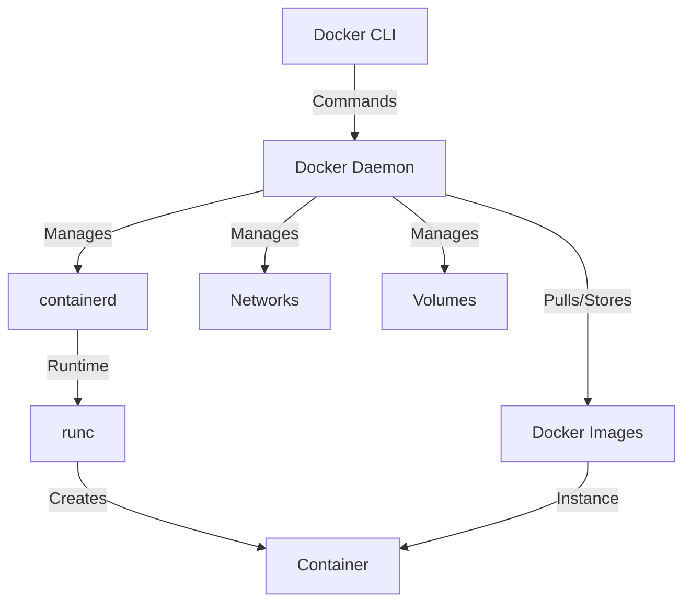
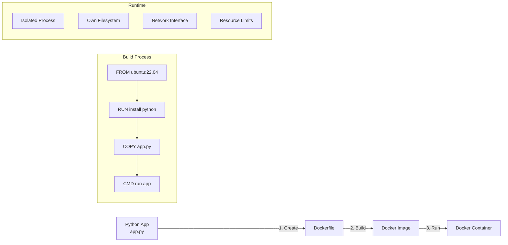
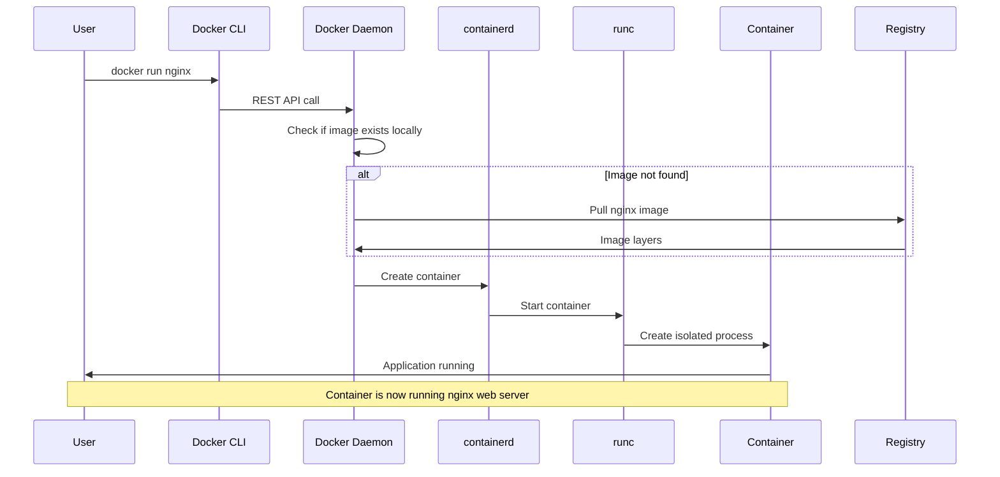

# Docker Learning Repository

Welcome to the comprehensive Docker learning repository! This collection contains practical examples and demonstrations of Docker concepts, from basic containerization to advanced orchestration techniques.

## 📁 Repository Structure

### 🐳 Available Learning Modules

| Folder | Description | Skills Covered |
|--------|-------------|----------------|
| **Docker_Simple_Image** | Basic Flask app containerization | Dockerfile basics, image building, container running |
| **Docker_Compose** | Multi-service application orchestration | Docker Compose, service definitions, networking |
| **Docker_MultiStageBuild** | Optimized image building techniques | Multi-stage builds, image size optimization |
| **Docker_Networks** | Container networking concepts | Network types, communication, isolation |
| **Docker_Volume** | Data persistence and sharing | Volume management, data persistence |

> 📖 **All examples include detailed `.md` documentation - feel free to explore, use, and execute!**

## 🐋 What is Docker?

Docker is a **containerization platform** that packages applications and their dependencies into lightweight, portable containers. Think of it as a **shipping container for software** - it ensures your application runs consistently anywhere Docker is installed.

### Key Benefits:
- ✅ **Consistency**: "It works on my machine" becomes "It works everywhere"
- ✅ **Portability**: Run the same container on development, testing, and production
- ✅ **Efficiency**: Share resources better than traditional VMs
- ✅ **Scalability**: Easy horizontal scaling and microservices architecture

## 📦 What is a Container?

A **container** is a lightweight, standalone executable package that includes:
- 🏗️ Application code
- 🔧 Runtime environment  
- 📚 System libraries
- ⚙️ Dependencies
- 🔨 Configuration files

**Containers vs VMs**: While VMs virtualize entire operating systems, containers share the host OS kernel, making them much more efficient.

## 🏗️ Docker Architecture & Components

### Core Components Overview



### 🔧 Docker Components Deep Dive

#### 1. **Docker CLI (Command Line Interface)**
- 💻 User-facing interface for Docker commands
- 🔗 Communicates with Docker Daemon via REST API
- 📝 Examples: `docker build`, `docker run`, `docker ps`

#### 2. **Docker Daemon (dockerd)**
- 🧠 Core engine that manages Docker objects
- 🔄 Handles image building, container lifecycle
- 🌐 Exposes REST API for Docker CLI communication
- 📡 Can communicate with other daemons for distributed deployments

#### 3. **containerd**
- 🏭 High-level container runtime
- 🔄 Manages container lifecycle (start, stop, pause, delete)
- 📦 Handles image transfers and storage
- 🔧 Industry-standard container runtime

#### 4. **runc**
- ⚡ Low-level container runtime
- 🏃 Actually creates and runs containers
- 📋 Implements OCI (Open Container Initiative) specification
- 🔒 Handles container isolation and security

#### 5. **Docker Images**
- 📸 Read-only templates for creating containers
- 🧱 Built in layers for efficiency and reusability
- 💾 Stored in registries (Docker Hub, private registries)
- 🔄 Versioned and shareable

## 🚀 Docker Workflow: From Code to Container



### Step-by-Step Process:

1. **📝 Write Application** (`app.py`)
   ```python
   # Your Python application code
   ```

2. **🏗️ Create Dockerfile**
   ```dockerfile
   FROM ubuntu:22.04
   RUN apt-get update && apt-get install -y python3
   COPY app.py /app/
   CMD ["python3", "/app/app.py"]
   ```

3. **🔨 Build Image**
   ```bash
   docker build -t my-app .
   ```

4. **🚀 Run Container**
   ```bash
   docker run -p 8080:8080 my-app
   ```

## ⚡ Docker vs Virtualization

### 🎯 Key Differences Explained

| Aspect | 🐋 **Docker Containers** | 🖥️ **Virtual Machines** |
|--------|-------------------------|------------------------|
| **Resource Usage** | Lightweight - shares host OS kernel | Heavy - each VM runs full OS |
| **Startup Time** | Seconds ⚡ | Minutes 🐌 |
| **Isolation** | Process-level isolation | Hardware-level isolation |
| **Portability** | High - runs anywhere Docker exists | Medium - depends on hypervisor |
| **Resource Overhead** | Minimal | Significant |

### 💎 Golden Explanations:

#### 🏠 **Virtualization**: 
> "Like having separate apartments in a building - each has its own utilities, kitchen, and living space (full OS). Secure but resource-heavy."

#### 📦 **Containerization**: 
> "Like having separate rooms in a shared house - each room is private, but they share utilities (OS kernel). Efficient and lightweight."

#### ⚡ **Performance**: 
> "Containers are like running apps natively, VMs are like running apps inside another computer. Containers win on speed and efficiency."

## 🔄 Docker Components Interaction Flow



## 🚀 Quick Start Guide

### Prerequisites
- Docker installed on your system
- Basic command line knowledge

### 🎯 Try Any Example:

1. **Navigate to any folder**:
   ```bash
   cd Docker_Simple_Image
   ```

2. **Follow the README.md** in that folder

3. **Build and run**:
   ```bash
   docker build -t example-app .
   docker run -p 8080:8080 example-app
   ```

## 📚 Learning Path Recommendation

1. 🟢 **Start here**: `Docker_Simple_Image` - Learn basic containerization
2. 🟡 **Next**: `Docker_MultiStageBuild` - Optimize your images  
3. 🟠 **Then**: `Docker_Volume` - Handle data persistence
4. 🔵 **After**: `Docker_Networks` - Understand container communication
5. 🟣 **Finally**: `Docker_Compose` - Orchestrate multi-service applications

## 🤝 Contributing

Feel free to:
- 🐛 Report issues
- 💡 Suggest improvements  
- 📖 Add more examples
- 🔧 Submit pull requests


---

**Happy Dockerizing! 🐳✨**